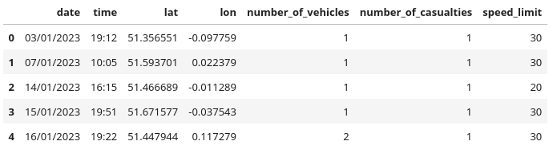
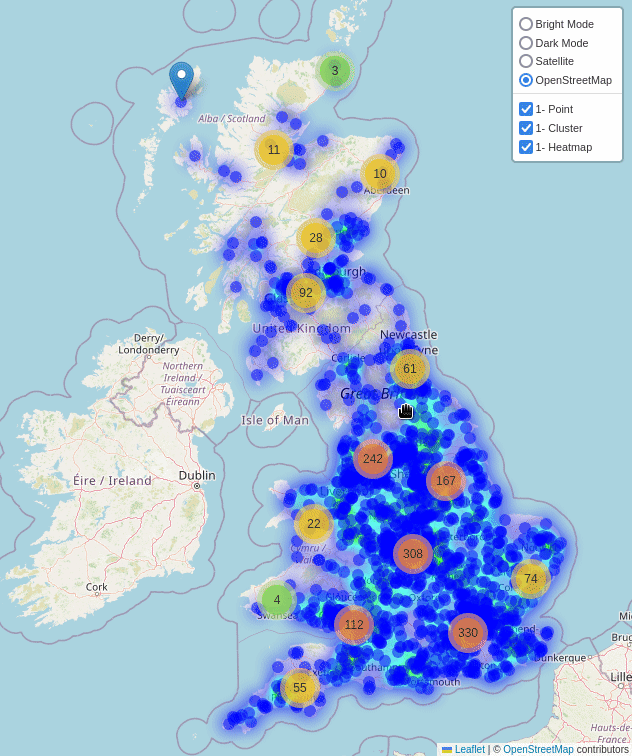

<h1 align="center"></h1>
<h1 align="center">GeoParse</h1>
<h3 align="center">It's all about points  lines  and polygons </h3>

---

[](https://geoparse.io)
[](https://geo-parse.readthedocs.io/en/latest/)
[](https://github.com/geoparse/geospatial/blob/main/LICENSE)
[](https://www.python.org/)
[](https://github.com/astral-sh/ruff)
[](https://github.com/geoparse/geospatial/graphs/contributors)


GeoParse is a Python library designed for the visualization, analysis, and manipulation of vector geospatial data. It builds on top of popular libraries like GeoPandas and Folium, providing a powerful toolkit for working with geospatial data. GeoParse focuses on efficient geospatial indexing, geometry manipulations, and utilities to handle OpenStreetMap data with ease.

---

## Key Features
* Efficient geospatial indexing using grid-based systems (H3, S2, Geohash)
* Data visualization using Folium maps
* Utilities for working with OpenStreetMap (OSM) data
* Geometry manipulations and conversions between formats
  
---

## Installation


`pip install git+https://github.com/geoparse/geospatial.git`

---

## Ducumentation
We recommend starting your GeoParse journey with the [tutorial notebooks](https://github.com/geoparse/geoparse/tree/main/tutorials).

The official API documentation is hosted on [ReadTheDocs](https://geo-parse.readthedocs.io/en/latest/)

---

## Examples

You can run [GeoParse examples](https://github.com/geoparse/geoparse/tree/main/tutorials) on MyBinder. No installation required. [](https://mybinder.org/v2/gh/geoparse/geoparse/main?labpath=tutorials%2F00_visualization.ipynb)

To try the cutting-edge dev version, use this MyBinder link.
### Point
```python
df = pd.read_csv("data/great_britain_road_casualties-2023.csv")
df.head()
```


```python
plp(df)                                        plp(df, heatmap=True, cluster=True)
```
    


### Polygon

```python
gdf = gpd.read_file("data/london.geojson")
plp(gdf)
```


---
### OSM Ways
```python
plp(osm_ways=[335265936, 53820456, 1117218957], s2_res=22, compact=True)
```


---
