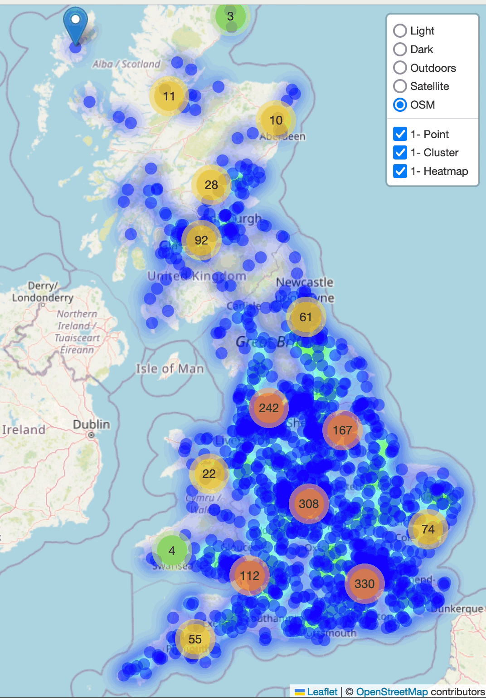

<h1 align="center"></h1>
<h1 align="center">GeoParse</h1>
<h3 align="center">It's all about points  lines  and polygons </h3>

---

[](https://geoparse.io)
[](https://geo-parse.readthedocs.io/en/latest/)
[](https://github.com/geoparse/geospatial/blob/main/LICENSE)
[](https://www.python.org/)
[](https://github.com/astral-sh/ruff)
[](https://github.com/geoparse/geospatial/graphs/contributors)


GeoParse is a Python library designed for the visualization, analysis, and manipulation of vector geospatial data. It builds on top of popular libraries like GeoPandas and Folium, providing a powerful toolkit for working with geospatial data. GeoParse focuses on efficient geospatial indexing, geometry manipulations, and utilities to handle OpenStreetMap data with ease.

---

## Key Features
* Efficient geospatial indexing using grid-based systems (H3, S2, Geohash)
* Data visualization using Folium maps
* Utilities for working with OpenStreetMap (OSM) data
* Geometry manipulations and conversions between formats
  
---

## Installation


`pip install git+https://github.com/geoparse/geospatial.git`

---

## Ducumentation
We recommend starting your GeoParse journey with the [tutorial notebooks](https://github.com/geoparse/geoparse/tree/main/tutorials).

The official API documentation is hosted on [ReadTheDocs](https://geo-parse.readthedocs.io/en/latest/)

---
## Tile Layers

GeoParse can visualize the vector data on a map with the following tile layers.

| Light                                                                                               | Dark                                                                                                |
| --------------------------------------------------------------------------------------------------- | -------------------------------------------------------------------------------------------------- | 
| A minimalist, light-colored basemap that serves as a subtle background, emphasizing overlaid data. | A high-contrast, dark-themed map ideal for vibrant data overlays and nighttime aesthetics.         |
|                                   |                                   |

| Outdoors                                                                                          | Satellite                                                                                       |
| ------------------------------------------------------------------------------------------------- | ------------------------------------------------------------------------------------------------ |
| Designed for outdoor enthusiasts, featuring hiking trails, biking paths, natural landmarks, and elevation contours. | A basemap displaying satellite imagery of the Earth's surface, useful for real-world context and analyses requiring detailed imagery. |
|                               |                            |

| OSM |
| --- |
| A general-purpose map powered by OpenStreetMap, showcasing roads, buildings, and points of interest. |
|  |

---
## GeoParse Modules

GeoParse provides a powerful suite of tools for anyone working with geospatial data. It allows users to handle basic tasks like geocoding and visualization as well as more advanced features like spatial indexing and OSM-based analysis. It includes four key modules, each focusing on different aspects of geospatial tasks.

* **karta**: The [karta](https://github.com/geoparse/geoparse/blob/main/geoparse/karta.py) module, named after the Swedish word for "map," is used to visualize vector data (points, lines, and polygons) on a map. The primary function, `plp` (point, line, polygon), supports various visualization styles and configurations, including clustering, heatmaps, choropleth maps, and cell-based layers (e.g., H3, S2, geohash). `karta` is ideal for creating interactive visual maps from geospatial data.

* **gutils**: The [gutils](https://github.com/geoparse/geoparse/blob/main/geoparse/gutils.py) stands for Geospatial Utilities and provides a wide range of geospatial utilities that serve various tasks such as geometric statistics, transformations, geocoding (address to coordinates), and distance or area calculations.

* **gindex**: The [gindex](https://github.com/geoparse/geoparse/blob/main/geoparse/gindex.py) module stands for Geospatial Index and specializes in spatial indexing systems. It converts geographic coordinates and geometries into spatial index representations and vice versa, utilizing popular encoding systems like Geohash, H3, and S2. It also accelerates computations through parallel processing, making it useful for efficient spatial queries and handling large datasets.

* **osmtools**: The [osmtools](https://github.com/geoparse/geoparse/blob/main/geoparse/osmtools.py) stands for OpenStreetMap Tools and offers tools to work with OpenStreetMap (OSM) data and routing engines built on top of OSM. It allows users to retrieve OSM way geometries (either polygons or lines), decode encoded polyline strings (such as those used by Valhalla and similar services), and perform map matching of GPS coordinates to road networks. This module is essential for extracting, analyzing, and visualizing OSM data as well as processing GPS traces with routing services.


---
## Examples

You can run [GeoParse examples](https://github.com/geoparse/geoparse/tree/main/tutorials) on MyBinder. No installation required. [](https://mybinder.org/v2/gh/geoparse/geoparse/main?labpath=tutorials%2F00_visualization.ipynb)

### Visualization: karta

`karta` accepts either a pandas `DataFrame` or a GeoPandas `GeoDataFrame` to visualize geometry data. In the case of a `DataFrame`, the `plp` function in karta identifies columns with names containing `lat` and `lon` and uses them as latitude and longitude to display the data on the map. The `plp` function can render Shapely `Point`, `LineString`, `Polygon`, and `MultiPolygon` objects.

### Point
```python
df = pd.read_csv("data/great_britain_road_casualties-2023.csv")
df.head()
```


| | |
|-|-|
| `plp(df)` | `plp(df, heatmap=True, cluster=True)` |
| |  |


### Polygon

```python
gdf = gpd.read_file("data/london.geojson")
plp(gdf)
```


---
### OSM Ways
```python
plp(osm_ways=[335265936, 53820456, 1117218957], s2_res=22, compact=True)
```


---
