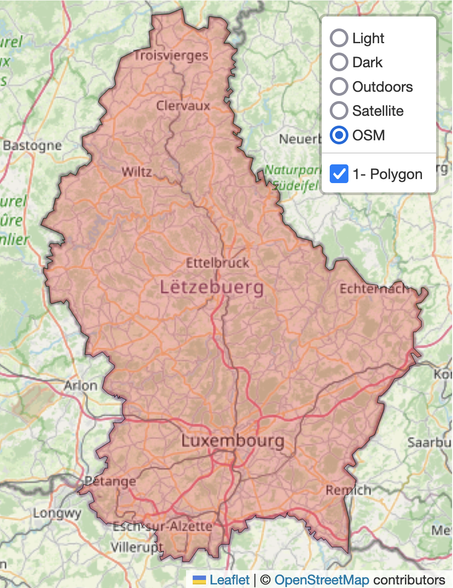
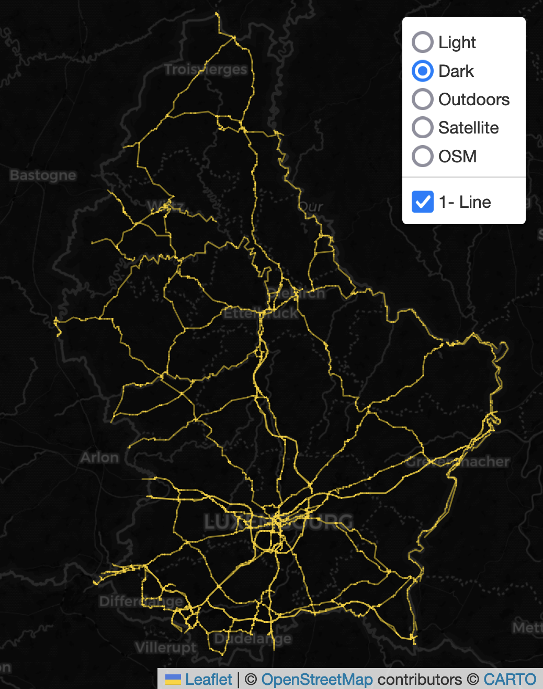
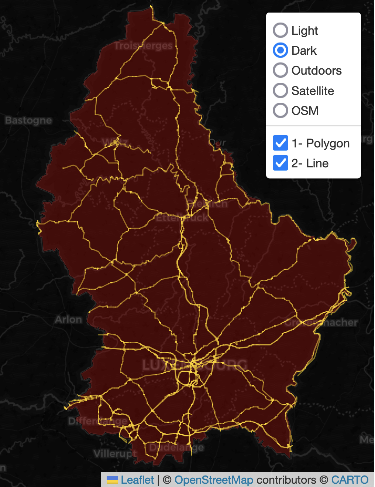
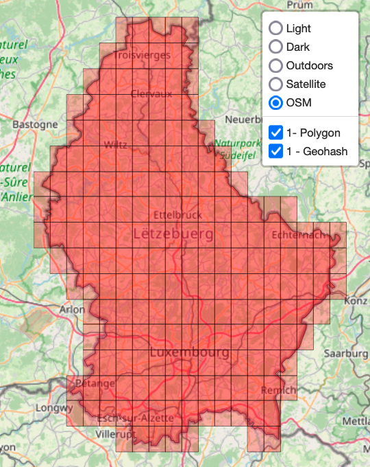
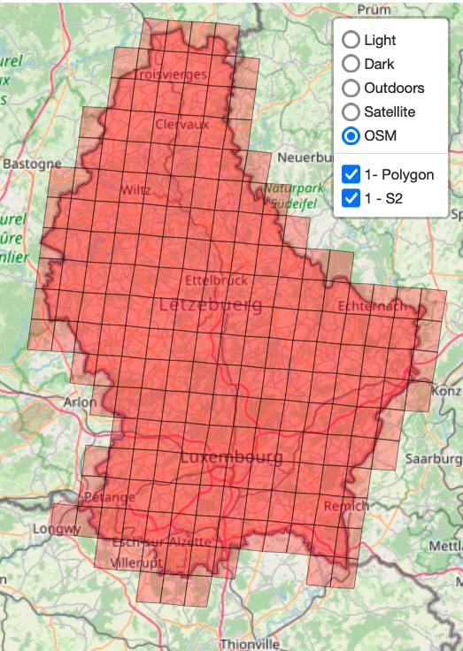
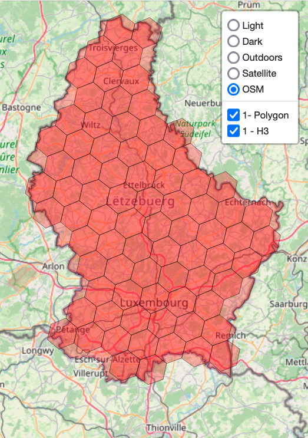
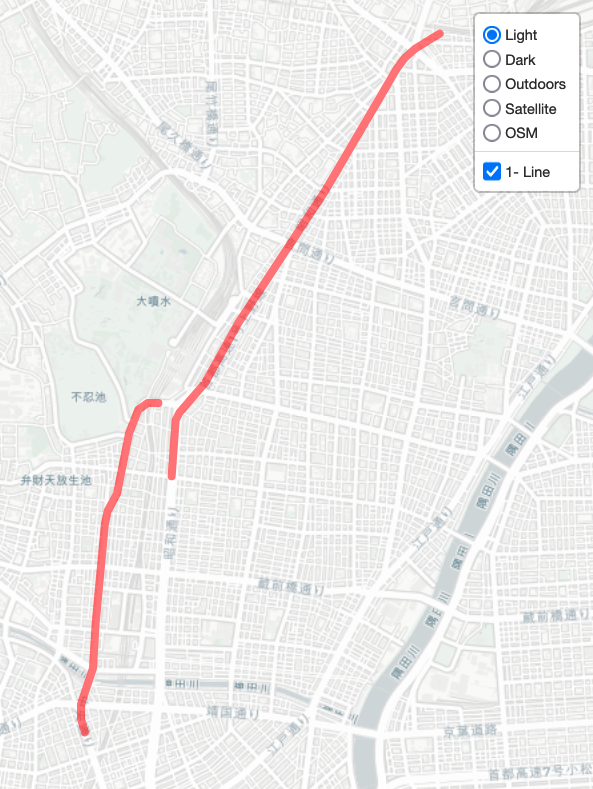
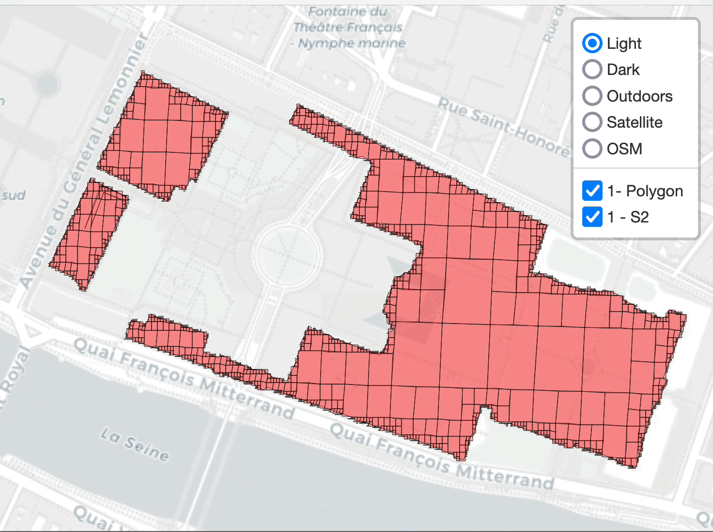

<h1 align="center"></h1>
<h1 align="center">GeoParse</h1>
<h3 align="center">It's all about points  lines  and polygons </h3>

---

[](https://geoparse.io)
[](https://geo-parse.readthedocs.io/en/latest/)
[](https://github.com/geoparse/geospatial/blob/main/LICENSE)
[](https://www.python.org/)
[](https://github.com/astral-sh/ruff)
[](https://github.com/geoparse/geospatial/graphs/contributors)


GeoParse is a Python library designed for the visualization, analysis, and manipulation of vector geospatial data. It builds on top of popular libraries like GeoPandas and Folium, providing a powerful toolkit for working with geospatial data. GeoParse focuses on efficient geospatial indexing, geometry manipulations, and utilities to handle OpenStreetMap data with ease.

---

## Key Features
* Efficient geospatial indexing using grid-based systems (H3, S2, Geohash)
* Data visualization using Folium maps
* Utilities for working with OpenStreetMap (OSM) data
* Geometry manipulations and conversions between formats
  
---

## Installation


`pip install git+https://github.com/geoparse/geospatial.git`

---

## Ducumentation
We recommend starting your GeoParse journey with the [tutorial notebooks](https://github.com/geoparse/geoparse/tree/main/tutorials).

The official API documentation is hosted on [ReadTheDocs](https://geo-parse.readthedocs.io/en/latest/)

---
## Tile Layers

GeoParse can visualize the vector data on a map with the following tile layers.

| Light                                                                                              | Dark                                                                                       |
| -------------------------------------------------------------------------------------------------- | ------------------------------------------------------------------------------------------ | 
| A minimalist, light-colored basemap that serves as a subtle background, emphasizing overlaid data. | A high-contrast, dark-themed map ideal for vibrant data overlays and nighttime aesthetics. |
|                                   |                            |

| Outdoors                                                                                          | Satellite                                                                                       |
| ------------------------------------------------------------------------------------------------- | ----------------------------------------------------------------------------------------------- |
| Designed for outdoor enthusiasts, featuring hiking trails, biking paths, natural landmarks, and elevation contours. | A basemap displaying satellite imagery of the Earth's surface, useful for real-world context and analyses requiring detailed imagery. |
|                               |                            |

| OSM |
| --- |
| A general-purpose map powered by OpenStreetMap, showcasing roads, buildings, and points of interest. |
|  |

---
## GeoParse Modules

GeoParse provides a powerful suite of tools for anyone working with geospatial data. It allows users to handle basic tasks like geocoding and visualization as well as more advanced features like spatial indexing and OSM-based analysis. It includes four key modules, each focusing on different aspects of geospatial tasks.

* **karta**: The [karta](https://github.com/geoparse/geoparse/blob/main/geoparse/karta.py) module, named after the Swedish word for "map," is used to visualize vector data (points, lines, and polygons) on a map. The primary function, `plp` (point, line, polygon), supports various visualization styles and configurations, including clustering, heatmaps, choropleth maps, and cell-based layers (e.g., H3, S2, geohash). `karta` is ideal for creating interactive visual maps from geospatial data.

* **gutils**: The [gutils](https://github.com/geoparse/geoparse/blob/main/geoparse/gutils.py) stands for Geospatial Utilities and provides a wide range of geospatial utilities that serve various tasks such as geometric statistics, transformations, geocoding (address to coordinates), and distance or area calculations.

* **gindex**: The [gindex](https://github.com/geoparse/geoparse/blob/main/geoparse/gindex.py) module stands for Geospatial Index and specializes in spatial indexing systems. It converts geographic coordinates and geometries into spatial index representations and vice versa, utilizing popular encoding systems like Geohash, H3, and S2. It also accelerates computations through parallel processing, making it useful for efficient spatial queries and handling large datasets.

* **osmtools**: The [osmtools](https://github.com/geoparse/geoparse/blob/main/geoparse/osmtools.py) stands for OpenStreetMap Tools and offers tools to work with OpenStreetMap (OSM) data and routing engines built on top of OSM. It allows users to retrieve OSM way geometries (either polygons or lines), decode encoded polyline strings (such as those used by Valhalla and similar services), and perform map matching of GPS coordinates to road networks. This module is essential for extracting, analyzing, and visualizing OSM data as well as processing GPS traces with routing services.


---
## Examples

You can run [GeoParse examples](https://github.com/geoparse/geoparse/tree/main/tutorials) on MyBinder. No installation required. [](https://mybinder.org/v2/gh/geoparse/geoparse/main?labpath=tutorials%2F00_visualization.ipynb)

### karta

`karta` is used for visualization and accepts either a pandas `DataFrame` or a GeoPandas `GeoDataFrame` to render geometry data. For a `DataFrame`, the `plp` function in `karta` automatically identifies columns with names containing "lat" and "lon" (case-insensitive) to use as latitude and longitude for plotting points on the map. If no columns contain these keywords, or if more than two columns contain these keywords, you must explicitly specify the latitude and longitude using the `y` and `x` parameters, respectively, e.g., `plp(df, x="easting", y="northing")`. Note that plp assumes all data is in the [EPSG:4326](https://epsg.io/4326) projection. For a `GeoDataFrame`, the `plp` function can render Shapely objects such as `Point`, `LineString`, `Polygon`, and `MultiPolygon`.


#### Point
In the following example, we demonstrate how to display points from a CSV file, customize the map with point colors and popups, and add layers such as heatmaps and clusters.

```python
import pandas as pd
from geoparse.karta import plp

df = pd.read_csv("data/great_britain_road_casualties-2023.csv")
df.head()
```
| date       | time  | latitude  | longitude  | number_of_vehicles | number_of_casualties | speed_limit |
|------------|-------|-----------|------------|--------------------|----------------------|-------------|
| 03/01/2023 | 19:12 | 51.356551 | -0.097759  | 1                  | 1                    | 30          |
| 07/01/2023 | 10:05 | 51.593701 | 0.022379   | 1                  | 1                    | 30          |
| 14/01/2023 | 16:15 | 51.466689 | -0.011289  | 1                  | 1                    | 20          |
| 15/01/2023 | 19:51 | 51.671577 | -0.037543  | 1                  | 1                    | 30          |
| 16/01/2023 | 19:22 | 51.447944 | 0.117279   | 2                  | 1                    | 30          |

After loading the data, we can easily display it on a map using `plp(df)`. For a more advanced visualization, we can customize the color of the points based on a feature value (e.g., `speed_limit` in the right map) and create HTML popups that display the attributes of each point.

<table>
  <tr>
    <td style="vertical-align: bottom;">
      <pre><code>plp(df)</code></pre>
    </td>
    <td style="vertical-align: bottom;">
      <pre><code>
plp(df, 
    point_color = 'speed_limit', 
    point_popup = {
        'Date': 'date',
        'Number of Casualties': 'number_of_casualties'
    }
)</code></pre>
    </td>
  </tr>
  <tr>
    <td>
      
    </td>
    <td>
      
    </td>
  </tr>
</table>

`plp` can also add heatmap and cluster layers to the map. In the left image, we see the clusters and heatmap of fatal road crashes in Great Britain. If you are working with trajectory data, `plp` can display the direction of movement using the antpath parameter, as shown in the right image.

<table>
  <tr>
    <td style="vertical-align: bottom;">
      <pre><code>plp(df, heatmap=True, cluster=True)</code></pre>
    </td>
    <td style="vertical-align: bottom;">
      <pre><code>
plp(df, antpath=True, line=True)
      </code></pre>
    </td>
  </tr>
  <tr>
    <td>
      
    </td>
    <td>
      
    </td>
  </tr>
</table>

### Line and Polygon

Using `GeoPandas`, we can read a geospatial file and display its contents using `plp` function. The left image illustrates the border of Luxembourg, represented as a Shapely `Polygon` object. The center image depicts the main roads in Luxembourg, represented as Shapely `LineString` objects. Additionally, `plp` can accept two `GeoDataFrame` objects as a list and display both of them on a single map, as shown in the right image.

| Polygn                                       | LineString                                        | Both                                                            |
| -------------------------------------------- | --------------------------------------------------|---------------------------------------------------------------- | 
| `plp(border_gdf)`                            | `plp(road_gdf, line_color='gold', line_weight=1)` | `plp([border_gdf, road_gdf], line_color='gold', line_weight=1)` |
| |       |              |


Using the `plp` function, we can also add spatial index polygonal layers such as `GeoHash`, Google `S2`, and Uber `H3`. 


| Geohash                                      | S2                                                | H3                                                              |
| -------------------------------------------- | --------------------------------------------------|---------------------------------------------------------------- | 
| `plp(border_gdf, geohash_res=5)`             | `plp(border_gdf, s2_res=11)`                      | `plp(border_gdf, h3_res=6)`                                     |
|         |                  |                                 |
 
If the `compact` parameter is set to True, `plp` calculates the parent cell IDs to create a compact representation of the cells.

| Geohash                                      | S2                                                | H3                                                              |
| -------------------------------------------- | --------------------------------------------------|---------------------------------------------------------------- | 
| `plp(border_gdf, geohash_res=7, compact=True)`             | `plp(border_gdf, s2_res=15, compact=True)`                      | `plp(border_gdf, h3_res=10, compact=True)`                                     |
|         |                  |                                 |
 

---
### OSM Ways

The `plp` function can also accept `OpenStreetMap` (OSM) Way IDs instead of `DataFrame` or `GeoDataFrame` objects and visualize them as `LineString` or `Polygon` geometries. The left image illustrates two ways of the Tokyo Metro Line represented as `LineString` geometries, while the right image depicts three ways in the Louvre Museum visualized as `Polygon` geometries.

|                                    |                                                                 | 
| ------------------------------------------ | --------------------------------------------------------------------------|
| `plp(osm_ways=[893074361, 666201240])`     | `plp(osm_ways=[335265936, 53820456, 1117218957], s2_res=22, compact=True)`| 
| |  | 


---
